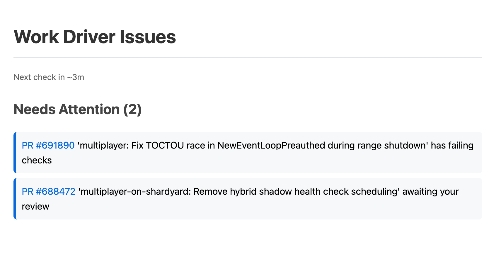

# work-driver

A periodic checker that monitors your GitHub PRs and LaunchDarkly feature flags, sending desktop notifications when action is needed.



## Features

- **GitHub PR Monitoring**: Tracks PRs you've authored (failing checks, draft PRs with all checks passing, approved PRs missing the ready-to-merge label) and PRs awaiting your review
- **LaunchDarkly Flag Monitoring**: Monitors your boolean flags for stale partial rollouts (staging >2h, production >18h) and flags rolled out in staging but not started in production
- **Live Dashboard**: Local HTTP server serves an HTML dashboard with a countdown to the next check, clickable links to PRs and flags, and "Needs Attention" / "Recently Reviewed" sections
- **Seen State Tracking**: Clicking an issue in the dashboard marks it as seen — seen issues move to "Recently Reviewed" and are suppressed from notifications for 30 minutes
- **Notification Throttling**: Desktop notifications via `terminal-notifier` are throttled per-issue so the same problem doesn't re-alert within 19 minutes

## Setup

### Prerequisites

- Rust toolchain (cargo, rustc)
- `terminal-notifier` (install via `brew install terminal-notifier`)
- `gh` CLI authenticated with GitHub (install via `brew install gh`)
- LaunchDarkly API token

### Environment Variables

Required:
- `LAUNCHDARKLY_API_TOKEN`: Your LaunchDarkly API token
- `LAUNCHDARKLY_MAINTAINER_ID`: Your LaunchDarkly maintainer ID

Optional:
- `LAUNCHDARKLY_PROJECT_KEY`: LaunchDarkly project key (defaults to "default")

### Installation

```bash
cargo build --release
```

The binary will be available at `./target/release/work-driver`.

## Usage

### Manual Run

```bash
./target/release/work-driver
```

### Launchd Setup (Recommended for macOS)

The repository includes a launchd plist configured to run at :15 and :45 past every hour.

**Initial setup:**
```bash
# Create symlink from LaunchAgents to the repo
ln -s $(pwd)/com.dtsung.work-driver.plist ~/Library/LaunchAgents/com.dtsung.work-driver.plist

# Load the job
launchctl load ~/Library/LaunchAgents/com.dtsung.work-driver.plist
```

**Managing the service:**
```bash
# Unload (stop running)
launchctl bootout gui/$(id -u)/com.dtsung.work-driver

# Load (start running)
launchctl load ~/Library/LaunchAgents/com.dtsung.work-driver.plist

# Check status
launchctl list | grep work-driver

# View logs
tail -f /tmp/work-driver.log
tail -f /tmp/work-driver-error.log
```

**After editing the plist:**
```bash
launchctl bootout gui/$(id -u)/com.dtsung.work-driver
launchctl load ~/Library/LaunchAgents/com.dtsung.work-driver.plist
```

### Alternative: Cron Setup

Add to your crontab to run every 30 minutes:

```bash
crontab -e
```

Add the following line (adjust paths as needed):

```
*/30 * * * * cd /Users/dtsung/Documents/work-driver && \
  LAUNCHDARKLY_API_TOKEN="your-token" \
  LAUNCHDARKLY_MAINTAINER_ID="your-id" \
  ./target/release/work-driver
```

## How It Works

### GitHub Checking

The tool checks:
1. **PRs you created**: Only reports if CI checks are failing
2. **PRs requesting your review**: Always reports these

It ignores the current branch to avoid noise.

### LaunchDarkly Checking

The tool monitors boolean feature flags where:
- You are the maintainer
- Flag is at a partial rollout (<50% in staging or <100% in production)
- Flag hasn't been updated in the last 18 hours

Non-boolean flags are skipped. The "enabled" variation is detected by looking for a variation named "enabled" or with value `true`.

### Notifications

When issues are found:
1. A concise notification is sent (e.g., "2 PRs and 1 flag need attention")
2. Detailed information is written to `~/Desktop/work-driver-issues.html`
3. Clicking the notification opens the HTML file in Chrome with clickable links to:
   - GitHub PRs: `https://github.com/figma/figma/pull/{number}`
   - LaunchDarkly flags: `https://app.launchdarkly.com/projects/{project}/flags/{key}/targeting?env=production&env=staging&selected-env={env}`

## Architecture

The project is organized into modules:

- `check.rs`: Defines the `Check` trait for extensible checking
- `github.rs`: GitHub PR checking implementation
- `launchdarkly.rs`: LaunchDarkly flag checking implementation
- `notifier.rs`: HTML generation and notification sending
- `main.rs`: Coordinator that runs all checks and sends notifications

## Testing

```bash
cargo test
```

The GitHub checker includes a test with sample PR data to verify parsing logic.